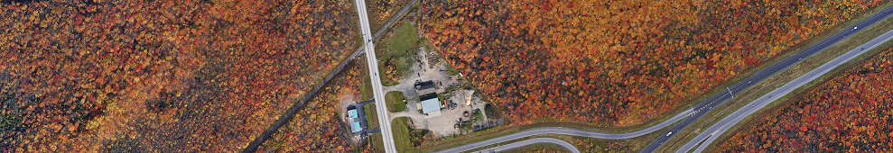
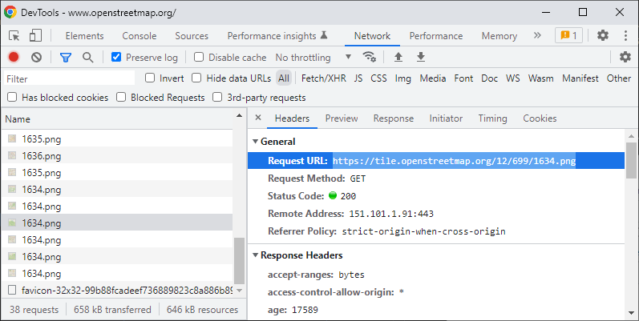
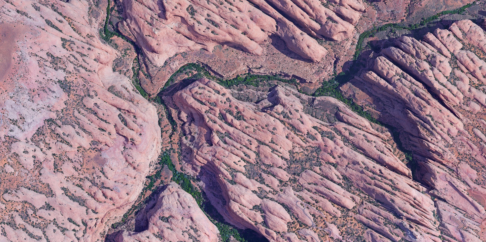
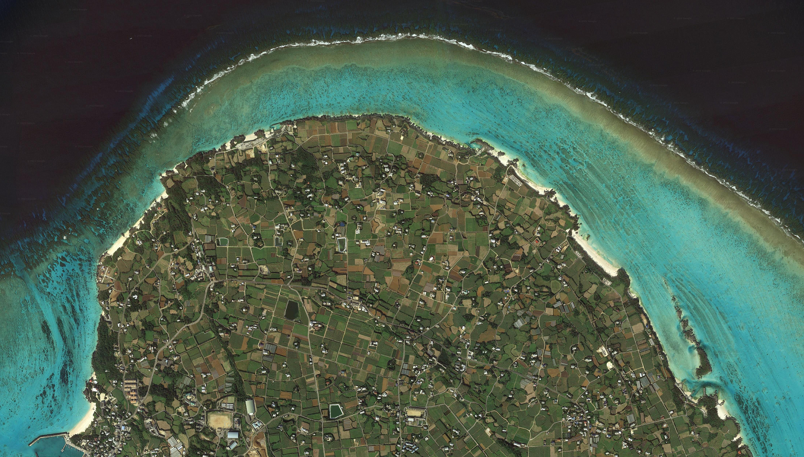
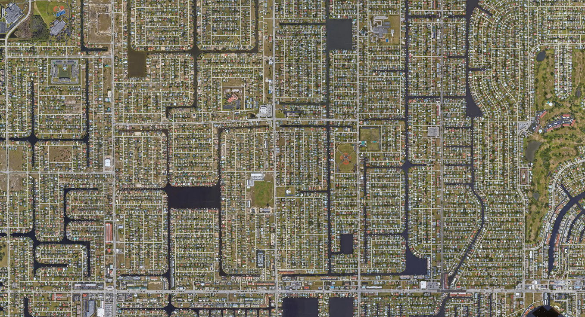
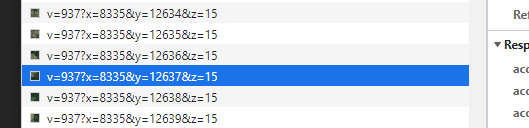
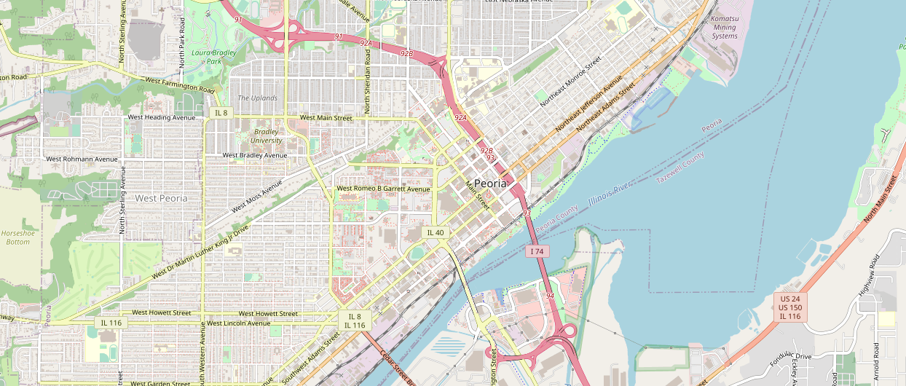

> [!WARNING]
> Please note that downloading map tiles without using the API may violate the map service's terms of use.

# Satellite Imagery Downloader

A Python program that downloads a rectangular map region by its geographic coordinates and saves it as a PNG image. It works by downloading map tiles at a given zoom level and cropping border tiles to fit the region.

This program should work with any raster map that uses [Web Mercator](https://en.wikipedia.org/wiki/Web_Mercator_projection), including Google Maps, Esri and OpenStreetMap.


<nobr><sup><sup>© 2023 Google</sup></sup></nobr>

## Usage

### Requirements
Make sure you have Python 3 installed.

Install the required packages.
```cmd
pip install -r requirements.txt
```

### Command line arguments and options
```
usage: MapTileDownloader.py [-h] [-z ZOOM] [-u URL] top_left bot_right [file]

Download map images from Google Maps or other tile servers.

positional arguments:
  top_left              Top-left corner of the map region (example: 50.048426,-66.813065)
  bot_right             Bottom-right corner of the map region (example: 50.024210,-66.763433)
  file                  Filename for the downloaded map (default: C:\Users\d174\source\repos\MapTileDownloader\src\img_<TIMESTAMP>.png)

options:
  -h, --help            show this help message and exit
  -z ZOOM, --zoom ZOOM  Zoom level for the map tiles (default: 14)
  -u URL, --url URL     tile URL service (default: https://mt.google.com/vt/lyrs=s&x={x}&y={y}&z={z})

Copyright (c) 2022 andolg (https://github.com/andolg)
Copyright (c) 2024 Eddy Beaupré (https://github.com/EddyBeaupre)

```

Coordinates should be entered in decimal degrees (latitude before longitude) with any separator you want, e.g. <nobr>`40.612123,-73.895381`</nobr>. By default, a zoom level of 14 is used but can be change by specifiying the <b>--zoom</b> option (example: <nobr>`--zoom 18`</nobr>). [This article](https://learn.microsoft.com/en-us/bingmaps/articles/understanding-scale-and-resolution) explains how it affects the scale and resolution.

Google Maps satellite imagery will be used by default. To use another service, specify the URL with the <b>--url</b> option using `{x}`, `{y}` and `{z}` to represent the coordinate and zoom values fields of the URL (example: <nobr>`--url 'https://tile.openstreetmap.org/{z}/{x}/{y}.png'`</nobr>)

If you encounter any problems with the program, feel free to open an issue.

## Tile URL
Here are some tile URLs that you can use:

* Google maps satellite imagery: `https://mt.google.com/vt/lyrs=s&x={x}&y={y}&z={z}` (default `"url"`). 
* Other Google Maps tile types: https://stackoverflow.com/questions/23017766/google-maps-tile-url-for-hybrid-maptype-tiles
* OpenStreetMap: `https://tile.openstreetmap.org/{z}/{x}/{y}.png` or `https://tile.osmand.net/df/{z}/{x}/{y}.png`
* Esri satellite imagery: `https://services.arcgisonline.com/arcgis/rest/services/World_Imagery/MapServer/tile/{z}/{y}/{x}`

If you need to download an image from a different map service, you can try to get the tile URL using your browser. Open the map, then open developer tools (Ctrl+Shift+I) and go to the Network panel. When you refresh the page or scroll the map, it logs the resources that are being downloaded. Find a tile, copy the URL and replace its coordinate and zoom values with `{x}`, `{y}` and `{z}`.



---
## Examples


<nobr><sup><sup>© 2022 Google</sup></sup></nobr>


<nobr><sup><sup>© 2022 Google</sup></sup></nobr>


<nobr><sup><sup>© 2022 Google</sup></sup></nobr>


<nobr><sup><sup>© 2023 Google</sup></sup></nobr>


<nobr><sup><sup>© OpenStreetMap</sup></sup></nobr>

## MIT License
Copyright (c) 2022 andolg (https://github.com/andolg)<br/>
Copyright (c) 2024 Eddy Beaupré (https://github.com/EddyBeaupre)

Permission is hereby granted, free of charge, to any person obtaining a copy
of this software and associated documentation files (the "Software"), to deal
in the Software without restriction, including without limitation the rights
to use, copy, modify, merge, publish, distribute, sublicense, and/or sell
copies of the Software, and to permit persons to whom the Software is
furnished to do so, subject to the following conditions:

The above copyright notice and this permission notice shall be included in all
copies or substantial portions of the Software.

THE SOFTWARE IS PROVIDED "AS IS", WITHOUT WARRANTY OF ANY KIND, EXPRESS OR
IMPLIED, INCLUDING BUT NOT LIMITED TO THE WARRANTIES OF MERCHANTABILITY,
FITNESS FOR A PARTICULAR PURPOSE AND NONINFRINGEMENT. IN NO EVENT SHALL THE
AUTHORS OR COPYRIGHT HOLDERS BE LIABLE FOR ANY CLAIM, DAMAGES OR OTHER
LIABILITY, WHETHER IN AN ACTION OF CONTRACT, TORT OR OTHERWISE, ARISING FROM,
OUT OF OR IN CONNECTION WITH THE SOFTWARE OR THE USE OR OTHER DEALINGS IN THE
SOFTWARE.
